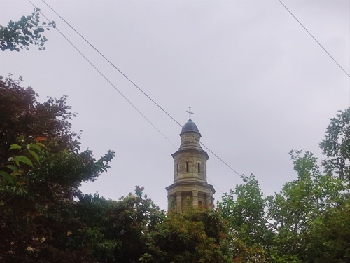
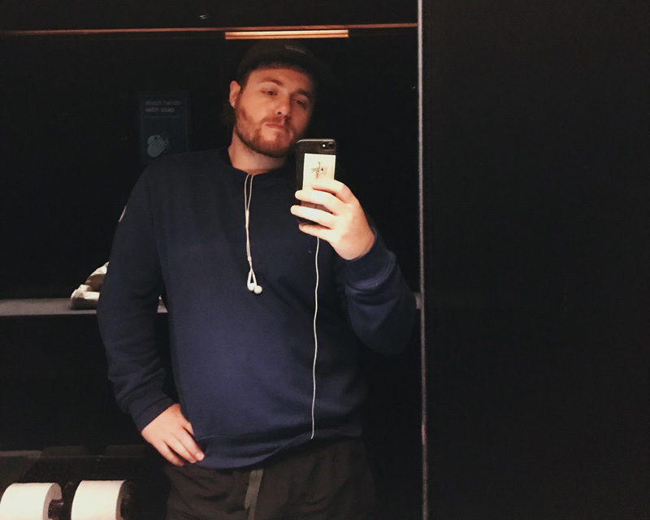
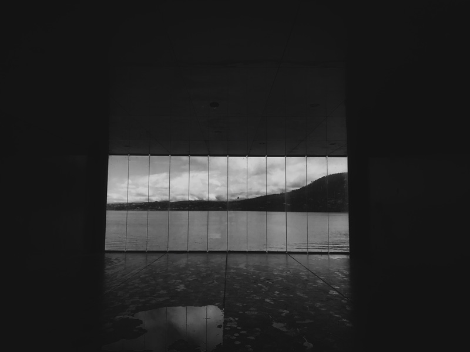
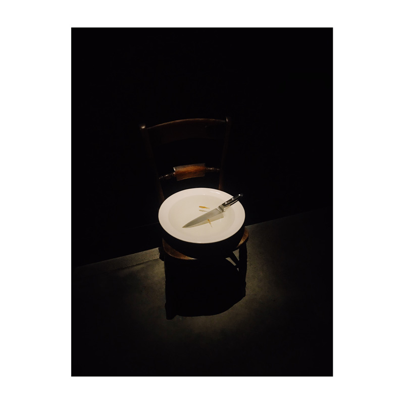

# The Heart Of Bart creative residency, reflection

I've spent the week in Hobart working away trying to do a number of things
- Make crayon emoji mobile friendly
- Improve return.horse
- Update my artist site to be something I can show people
- reflect on the year, plan for the year ahead

Reflection:
The last year was good creatively, I began to practice structuring my projects, calling them finished or not finished. Making them measurable, letting them fail. It was not as smooth and precise as I thought it would be, but it wasn't too bad either.  
Some projects ballooned out more than I expected, actually all of them did. I can learn from this!  

## Resonance
This was a really nice project. The typography and website were just okay, but the writing was super fun and so was the drawing. I want to do more comics with felt tip pens, a really cool medium!  
Maybe look at ways to make it less consumptive tho, refillable pens? 
Home made paint pens? Paint sticks? We will see. 

The point is, colour is fun. 

The way it was no pressure too was cool, and the requirement to draw things that looked right was not as much of a challenge as I expected.  
Maybe we go for something more complex next? Hmm perhaps, perhaps not.

## Crayon
This started out with [plot](../plot) and was really fun, I learnt a lot building it.  
It was interesting to see just how easy it is to make a complex feeling application, but also how quickly you run into bugs and complexity! 

The architecture was the biggest learning experience. 
Other lessons include: 
- UX and UI design is hard
- copy and paste is inconsistent
- emojis aren't that useful.

## Return.horse
I spent literal months on this, carefully making a 3D cowboy, only to realise I was focusing on the wrong thing. I should remember that the first measure for these projects is me, only later should other people be considered. 

The 3D was fun, but I would have been happy with the simple thing - and I am now. That being said, I think I can learn from the 3D experience, and I still really want to make more 3D comics. 

The most important part still lies ahead though! This will have > 300 comics before I'm finished - how exciting.

## Pledge
The pledge was, is, a difficult project. It's loads bigger than either of us expected. That being said, I've learnt heaps and heaps working on it, and for that I am grateful. I didn't work on it in Hobart.

## Home page
I didn't do very much work on this, but I did a little reflection and I'm happy with the changes I have made / will make. 

It is good to realise when something doesn't need to be worked on, when it can be left as it is and you can move on. 

I'm excited too for "the yard". Seeing how easy and fun it was to use .md files on beaker to make a website, there's no reason I can't have the same fun here. Also, hopefully, I'll get a few more cartoon projects up. 

Where and what for? Who can say, but the bee comic I made still makes me laugh now, and I want more of that.  
Could lead to some more reflection:
- what do I want, creatively? 
- How do I balance it? 
- Tools with code take a stupid amount of time, but make me more employable?  

Questions, questions, questions.

## General reflections for a good residency
- Have a strictish routine - eating hours, morning tea etc.
- Have at least one full day working
- Have at least one full day off
- Have at least 2 days split up
- Do something unique to the location (eg Mona)
- Go to the local museum
- Take advantage of what the location offers
  - For example, being away from melbourne helped with a fresh headspace. I wish I'd done more projects that made the most of that, rather than being bogged down with technical constraints in crayon emoji.
- Only work on one project
- Scope it before hand
- Write a daily journal (I didn't, but wish I did)
- Hang out with the locals

## the year ahead
I want to read and reflect more, then bring that into my practice. 

I want to do more small projects, quantity over quality. Critical mass. yada yada yada. 

Also, small projects can be polished easier and quicker. AND I learn so much more, and quicker with small projects! What good is a big project? Who does it help?? Small projects are the goal. 

Maybe I name the year? Give it a theme.  
~~2022: Make it smaller.~~  
2022: Small

